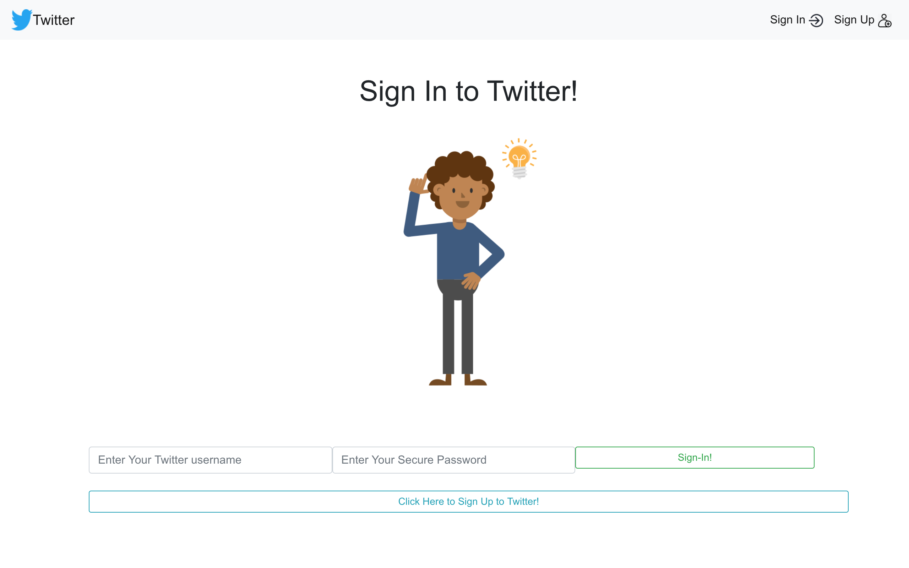

# Twitter - Built with the PERN Stack

A Full Stack PERN Application that explores RESTful API's in a CRUD (Create, Read, Update, Delete) App that users can sign up, sign in and make, edit and delete posts.

This application explores the PERN (PostgreSQL, Express, React, Node) full stack in greater detail. It uses a Node.js/Express.js to create a RESTful API's in the backend with an attached PostgreSQL database for storgae of the users and tweets. React.js was then used for the Single Page frontend server. This will dynamically render whenever a tweet is created, edited or deleted - it will then update and retrieve data from the database accordingly. The project wasTest driven using the Jest and Enzyme libraries.

### Features

- A user can sign up to Twitter (with unique credentials - duplicate username or email addresses will throw an error message)
- A user can sign in to their twitter account (references the database and throws an error message if no user exists)
- A user can sign out which will de-authenticate the session
- You can only view the '/' path until you sign in/up - otherwise it will always reroute to the same page
- Once logged in, a user can post a tweet, then edit or delete a tweet that they made
- A user can not delete or edit a tweet that does not belong to them

---

## User Stories

```
As a user
So that I can let people know what I am doing
I want to post a tweet to Twitter
```

```
As a user
So that I can see what others are saying
I want to see all tweets in reverse chronological order
```

```
As a user
So that I can post messages on Twitter as me
I want to sign up for Twitter
```

```
As a user
So that only I can post messages on Twitter as me
I want to log in to Twitter
```

```
As a user
So that I can avoid others posting messages on Twitter as me
I want to log out of Twitter
```

```
As a user
So that I can keep my tweets safe
I want to be the only person who can edit or delete my tweets
```

---

## How to Run

Clone this repo, make sure you have Node.js installed, and if using a mac, have the homebrew manager installed.

Then in the command line, navigate to the [**Server**](server) directory, and type:

```
brew install postgresql
```

```
npm install
```

This will install the dependencies needed, and install the PostgreSQL database application. You will then need to run PostgreSQL on your local machine by typing int he command line:

```
psql
```

Then open up the [**database.sql**](database.sql) and [**testDatabase.sql**](testDatabase.sql) files (inside [**database**](database) directory), and copy the `CREATE DATABASE`, `CREATE TABLE` and `ALTER TABLE` commands into the psql command line. This will create your database, and test database and your tables to store the descriptions of the tweets.

Update the [**db.js**](db.js) and [**testDb.js**](testDb.js) files with your `User` field from the Postgres (and any password if applicable).

Then from the command line, start up the server by navigating to the [**Server**](server) directory and type:

```
npx nodemon
```

This will start the Resful API backend and the PostgreSQL database. Then Open up a new terminal, and then navigate to the [**Client**](client) directory. From here in the command line, type in:

```
npm start
```

This will start up the Frontend, React interface. A tab on your browser will open with [**this**](http://localhost:3000/). From here you will see the Twitter User Interface instructing you to log in or sign up. Tweets can then be written, viewed, updated of deleted, this will be reflected in the Posgres database!

---

## Testing

To run the testing suite, navigaue to either the [server](server) or [client](client) directories. Then in the command line type:

```
npm test
```

This will start the Jest/Enzyme testing libraries and display _39_ passing tests for the `client`, _13_ Snapshot tests for the frontend UI, as well as _8_ passing tests for the Restful API `server`, with 100% coverage.

---

<table>
   <tr>
      <td>Welcome Page</td>
      <td>Sign In</td>
      <td>Sign Up</td>
  
   </tr>
   <tr>
   <td valign="top"></td>
   <td valign="top"></td>
   <td valign="top"></td>
   </tr>
  </table>

  <table>
   <tr>
      <td>Tweets</td>
        <td>Edit Tweet</td>
       <td>Sign Out</td>
  
   </tr>
   <tr>
   <td valign="top"></td>
   <td valign="top"></td>
   <td valign="top"></td>
   </tr>
  </table>

---
